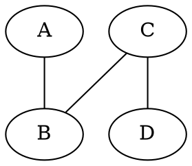

admissible herusitic:
if cost function never oversetimates the cost to reach a goal

optimistic heuristic:
cost it estimates is smaller than what it actually is

A* is optimal

heursitics:
8-puzzle
 - h1 = # tiles at the wrong position
 - h2 = # moves for each number to the right position

sokoban:
 - h0 = 0
 - h1 = # boxes not in goal
 - h2 = design yourself

hints for h2
 - manhattan distance
 - sum of distances of tiles from their goal position
 - add other helpful numbers
 - consider wall

grade:
 - runtime
 - accuracy

